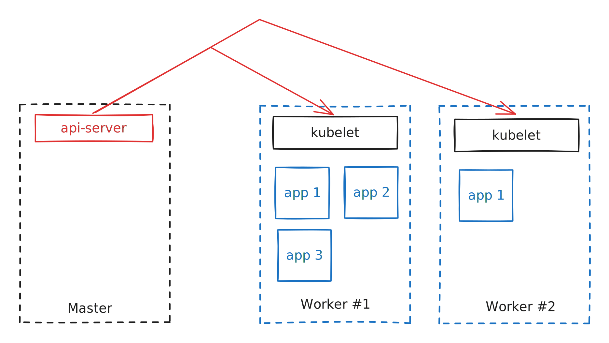

# Kubernetes Architecture

## Key Terms

### Node

**Definition:** A machine, physical or virtual, on which k8s is installed

**Two Types:**

1. Worker - hosts containers and have the `kubelet` process
2. Master - a node that is responsible for the actual orchestration of containers
   * contains the `kube-apiserver,` `etcd`, `controller`, and `scheduler`

### Cluster

**Definition:** a set of nodes connected together

## Installing k8s on a system installs the following

1. **API Server** - acts as frontend for k8s
2. **etcd** - distributed kv store to store data to manage cluster and implement logs within the cluster
3. **kubelet** - agent that runs on each worker node in the cluster
4. **Container Runtime** - underlying software used to run containers
5. **Controller** - noticing and responding to when things fail
6. **Scheduler** - distributing containers across nodes

## CLI Command Examples

`kubectl` - cli to interact with k8s

`kubectl run hello-minikube`

* deploy an application

`kubectl cluster-info`

* view information about the cluster

`kubectl get nodes`

* list all nodes in default namespace
